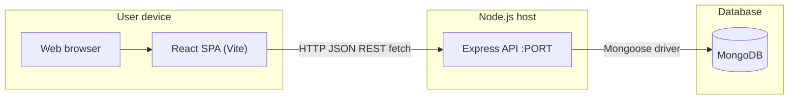
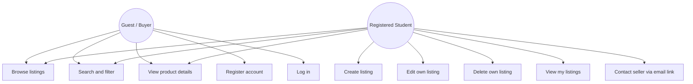
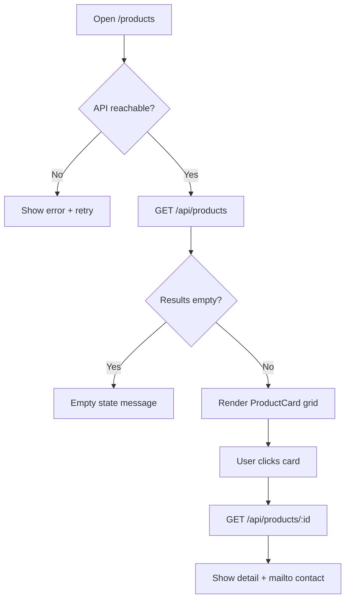
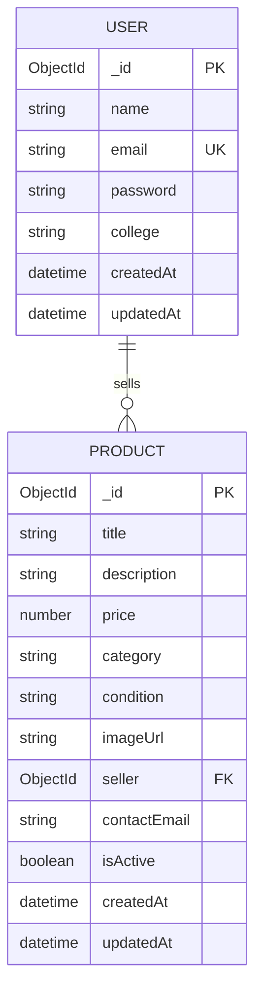
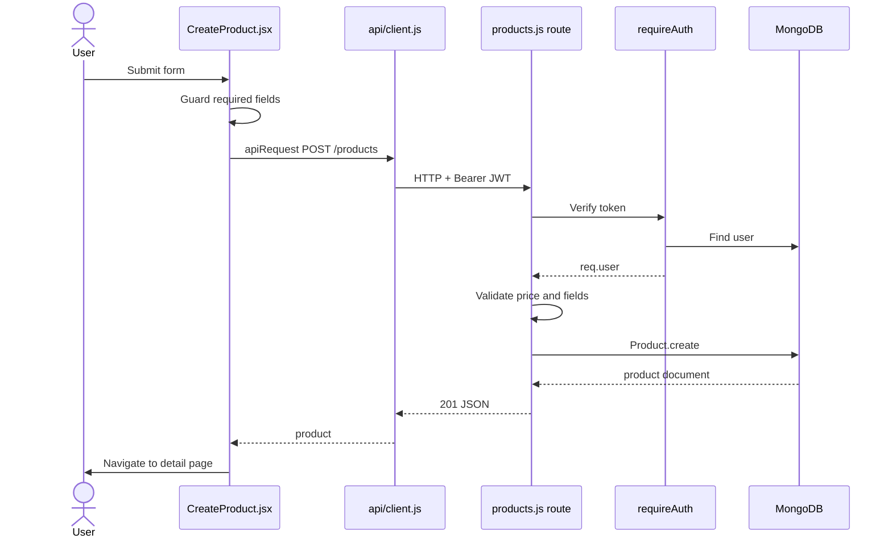
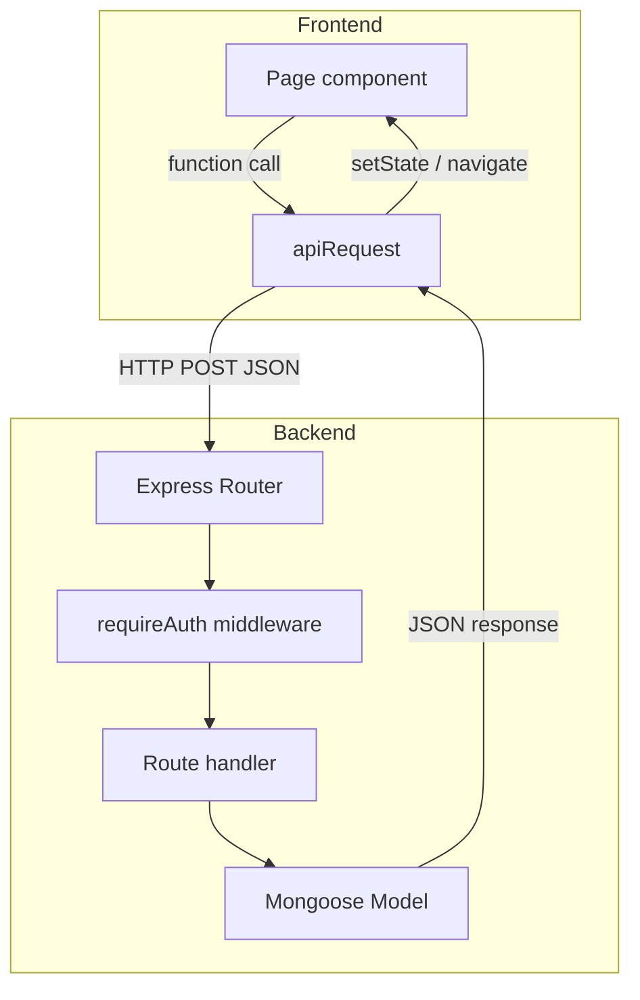

# CampusMart — Diagram Source (Mermaid)

Edit these blocks for reports or paste into [Mermaid Live Editor](https://mermaid.live). All diagrams reflect **implemented** code unless labeled *proposed*.

---

## 1. System architecture

**Explains:** Browser, React app, Express API, MongoDB — actual deployment for local dev.

**Code basis:** `client/`, `server/src/server.js`, `server/src/config/db.js`

**Assumption:** Single machine development; no separate CDN or load balancer.

---

## 2. Use cases (implemented)

**Explains:** What actors can do today.

**Code basis:** Routes in `auth.js`, `products.js`; public pages in `client/src/pages/`

*Proposed (not implemented):* in-app chat, payments, admin moderation.

---

## 3. Activity: Browse and open detail

**Explains:** Main buyer workflow.

**Files:** `Products.jsx`, `ProductDetail.jsx`, `products.js`

---

## 4. Entity-relationship (actual schema)

**Explains:** Only `User` and `Product` collections with seller reference.

**Code basis:** `User.js`, `Product.js`

No Order, Cart, or Message entities exist in code.

---

## 5. Sequence: Create listing (authenticated)

**Explains:** End-to-end IPC via HTTP.

---

## 6. Collaboration / communication (frontend ↔ backend)

**Explains:** Module responsibilities in one request (evaluation “collaboration diagram”).

**IPC note:** Here IPC means **inter-process communication between browser and Node** over TCP/HTTP, not shared memory between OS processes on one machine.

---

## Missing information

- Production hosting topology (not implemented).
- SSL/TLS termination (local HTTP only).
